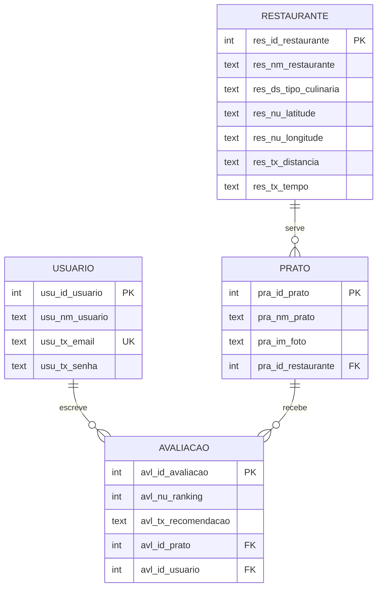

<div align="center">

# 🍽️ Coma Bem

**Descubra, cadastre e avalie restaurantes e pratos em um só lugar.**


</div>

---

## 📖 Sobre o projeto

O **Coma Bem** é um aplicativo multiplataforma desenvolvido em **Flutter** para quem gosta de comer bem e quer registrar boas experiências gastronômicas. Cada usuário cria uma conta, cadastra restaurantes, informa o prato em destaque (com foto) e atribui uma nota de 0 a 5 com um comentário. A tela inicial reúne os restaurantes com nota média, categoria culinária, distância e tempo estimado, com busca e filtros.

Todos os dados ficam armazenados **localmente em SQLite**, sem necessidade de servidor ou conexão para o funcionamento do app.

O repositório também traz uma parte dedicada a **Programação Orientada a Objetos** (herança, polimorfismo e encapsulamento) e o **script SQL** com a modelagem original do banco.

## ✨ Funcionalidades

- **Splash screen** de abertura com identidade visual própria
- **Cadastro e login de usuários**, com senha armazenada como hash SHA-256
- **Listagem de restaurantes** com nota média calculada a partir das avaliações e foto de capa
- **Busca** por nome do restaurante ou tipo de culinária
- **Filtro por categoria** gerado dinamicamente a partir dos restaurantes cadastrados
- **Cadastro de restaurante** com prato em destaque, foto, nota de 0 a 5 e comentário
- **Dados de exemplo** pré-carregados na primeira execução, para a home não abrir vazia
- **Pull-to-refresh** na lista de restaurantes
- **Tema personalizado** (paleta vinho e dourado) com as fontes *Fraunces* e *Nunito*

## 🛠️ Tecnologias

| Tecnologia | Uso |
| --- | --- |
| [Flutter](https://flutter.dev/) / [Dart](https://dart.dev/) | Framework e linguagem (SDK Dart `^3.12.2`) |
| [`sqflite`](https://pub.dev/packages/sqflite) | Banco SQLite em Android e iOS |
| [`sqflite_common_ffi`](https://pub.dev/packages/sqflite_common_ffi) | SQLite em Windows, Linux e macOS |
| [`sqflite_common_ffi_web`](https://pub.dev/packages/sqflite_common_ffi_web) | SQLite no navegador (experimental) |
| [`image_picker`](https://pub.dev/packages/image_picker) | Captura da foto do prato |
| [`google_fonts`](https://pub.dev/packages/google_fonts) | Tipografia do app |
| [`crypto`](https://pub.dev/packages/crypto) | Hash SHA-256 das senhas |
| [`path`](https://pub.dev/packages/path) | Caminho do arquivo do banco |

## 🗂️ Estrutura do projeto

```text
coma_bem/
├── database_scripts/
│   └── coma_bem.sql              # Modelagem original (MySQL): tabelas, dados e consultas
├── lib/
│   ├── main.dart                 # Ponto de entrada, rotas e tema
│   ├── components/               # Widgets reutilizáveis (botão, campo, nota, fundo)
│   ├── database/
│   │   ├── database_helper.dart  # Criação do banco, migração e operações (CRUD)
│   │   └── banco_plataforma*.dart# Configuração do SQLite por plataforma (io / web)
│   ├── models/                   # Classes de domínio (POO)
│   ├── screens/                  # Splash, login, cadastro de usuário, home e cadastro de restaurante
│   ├── theme/app_theme.dart      # Paleta de cores e ThemeData
│   ├── simulador_terminal.dart   # Simulador de POO no terminal
│   ├── teste_heranca.dart        # Demonstração de herança e polimorfismo
│   └── teste_fluxo.dart          # Demonstração da classe Restaurante
├── test/
└── pubspec.yaml
```

## 🗄️ Modelo de dados



O app usa **SQLite** (`coma_bem.db`), criado automaticamente na primeira execução. O arquivo [`database_scripts/coma_bem.sql`](database_scripts/coma_bem.sql) contém a modelagem equivalente em **MySQL**, com inserts de exemplo e consultas de `SELECT`, `INNER JOIN`, `UPDATE` e `DELETE`.

> **Nota:** a versão atual do schema é a `4`. Ao subir a versão do banco, o `onUpgrade` apaga e recria as tabelas, o que é adequado ao ambiente de desenvolvimento, mas **não preserva dados** em uma futura versão de produção.

## 🚀 Como executar

### Pré-requisitos

- [Flutter SDK](https://docs.flutter.dev/get-started/install) com Dart `^3.12.2`
- Um destino de execução: emulador Android, dispositivo físico, ou desktop (Windows, Linux ou macOS)
- Para desktop, as ferramentas de build da plataforma (Visual Studio no Windows, CMake/GTK no Linux, Xcode no macOS)

Confira o ambiente com:

```bash
flutter doctor
```

### Instalação

```bash
# 1. Clone o repositório
git clone <URL_DO_REPOSITORIO>
cd coma_bem

# 2. Instale as dependências
flutter pub get

# 3. Execute o app
flutter run
```

Para escolher a plataforma:

```bash
flutter devices            # lista os dispositivos disponíveis
flutter run -d windows     # ou: linux, macos, ou o id do emulador
```

### Executando pelo navegador (experimental)

O suporte a SQLite na web depende do arquivo `sqlite3.wasm`. Antes da primeira execução, rode, na pasta do projeto:

```bash
dart run sqflite_common_ffi_web:setup
flutter run -d chrome
```

### Simuladores de POO (terminal)

Os arquivos abaixo são Dart puro e rodam sem o Flutter:

```bash
dart run lib/simulador_terminal.dart   # menu interativo de cadastro e polimorfismo
dart run lib/teste_heranca.dart        # herança e polimorfismo entre perfis de usuário
dart run lib/teste_fluxo.dart          # catálogo de restaurantes
```

## 🧱 Conceitos de POO aplicados

| Conceito | Onde aparece |
| --- | --- |
| **Abstração** | Classe abstrata `Usuario`, com os métodos `exibirMenu()` e `gerenciarConta()` |
| **Herança** | `Cliente`, `Administrador` e `DonoRestaurante` estendem `Usuario` |
| **Polimorfismo** | Cada perfil implementa o próprio menu e a própria gestão de conta |
| **Encapsulamento** | Atributos privados com `getters` e `setters`, incluindo validação de senha (mínimo de 6 caracteres) |

## 🎨 Identidade visual

O tema é centralizado em `lib/theme/app_theme.dart`.

| Cor | Hex |
| --- | --- |
| Vinho | `#6E1423` |
| Vinho escuro | `#3D0B12` |
| Dourado | `#C9A227` |
| Creme | `#FAF3EE` |

Tipografia: **Fraunces** nos títulos e **Nunito** nos textos.

## ⚠️ Limitações conhecidas e próximos passos

- [ ] Abas **Explorar**, **Favoritos** e **Perfil** da barra inferior ainda estão em construção
- [ ] Favoritos são mantidos apenas em memória, sem persistência no banco
- [ ] Tela "Ver todos" ainda não implementada
- [ ] A foto do prato é capturada pela **câmera**; no desktop, incluir seleção de arquivo/galeria
- [ ] Usar a localização do dispositivo (`geolocator` já está nas dependências) para calcular distância real
- [ ] Reforçar o armazenamento de senhas com *salt* e algoritmo próprio para senhas (bcrypt ou Argon2)
- [ ] Atualizar o teste de widget padrão e ampliar a cobertura de testes

## 👤 Autor

**[Seu nome]**

[GitHub](https://github.com/seu-usuario) · [LinkedIn](https://www.linkedin.com/in/seu-usuario)

---

<div align="center">

Feito com 💛 e Flutter

</div>